# 🛒 Retail Customer Analysis (Python Case Study)

[](https://www.python.org/)
[](https://pandas.pydata.org/)
[](notebooks/Retail-Case-Study.ipynb)

## 📌 Project Overview
This project focuses on analyzing retail customer transaction data to understand customer behavior, store performance, and product category trends.
The analysis is performed using Python and popular data analysis libraries to extract meaningful insights from raw transactional data.
This project is created for learning, portfolio, and demonstration purposes.

---

## 🗂 Repository Structure
```
├── datasets/     # Source CSVs (Customer, Transactions, Product Hierarchy)
├── notebooks/    # Full Jupyter Notebook with the end-to-end analysis
├── images/       # EDA visualizations exported from the notebook
└── README.md
```

---

## 🎯 Objectives
The key goals of this analysis are:
- Understand customer purchasing behavior
- Identify top-performing product categories
- Compare store performance by sales value and quantity
- Analyze demographic trends such as age and gender
- Perform time-based transaction analysis

---

## 📂 Dataset Description
The analysis is based on three structured datasets, available in [`datasets/`](datasets/):

### 1️⃣ [Customer](datasets/Customer.csv)
Contains demographic details of customers:
- Customer ID
- Date of Birth
- Gender
- City Code

### 2️⃣ [Transactions](datasets/Transactions.csv)
Contains transaction-level data:
- Transaction ID
- Customer ID
- Transaction Date
- Product Category & Sub-category
- Quantity
- Total Amount
- Store Type

### 3️⃣ [Product Hierarchy](datasets/prod_cat_info.csv)
Maps product categories and sub-categories:
- Product Category Code & Name
- Product Sub-category Code & Name

📓 Full analysis notebook: [Retail-Case-Study.ipynb](notebooks/Retail-Case-Study.ipynb)

---

## 🛠️ Tools & Technologies Used
- Python
- Pandas – data manipulation & analysis
- NumPy – numerical operations
- Matplotlib – data visualization
- Jupyter Notebook

---

## 📊 Analysis Performed
The following analytical tasks were completed:
- Merged customer, transaction, and product hierarchy datasets
- Generated summary statistics and data profiles
- Visualized numerical and categorical variables
- Identified transaction time range and negative transactions
- Compared product category popularity by gender
- Determined city with the highest number of customers
- Analyzed store performance by sales value and quantity
- Calculated revenue from Electronics and Clothing in flagship stores
- Measured revenue contribution from male customers in Electronics
- Identified customers with high transaction frequency
- Analyzed spending behavior of customers aged 25–35

---

## 📉 Exploratory Data Analysis — Visuals

### Continuous Variable Distributions (Histograms)

| | |
|---|---|
| 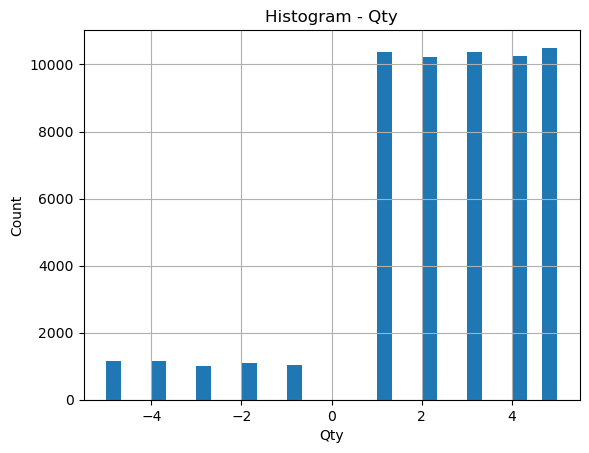 | 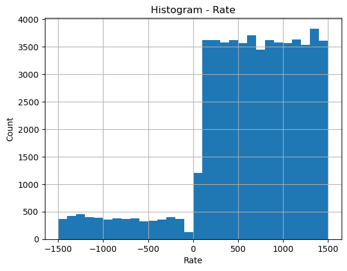 |
| 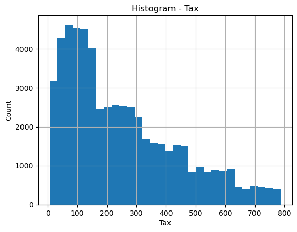 | 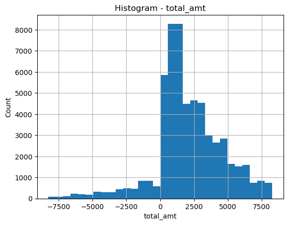 |
| 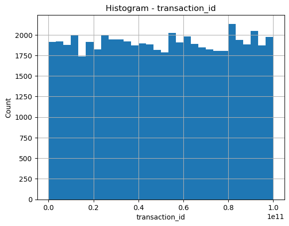 | 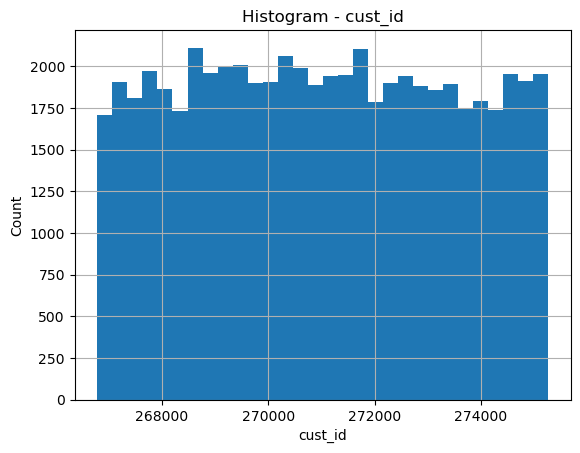 |
| 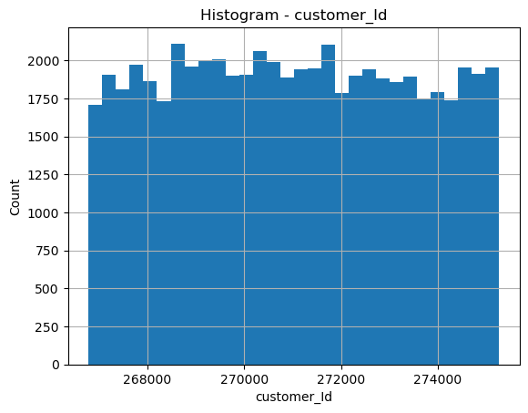 | 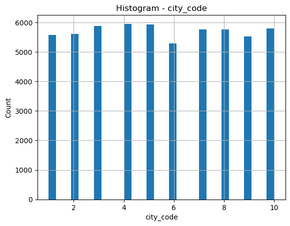 |
|  | 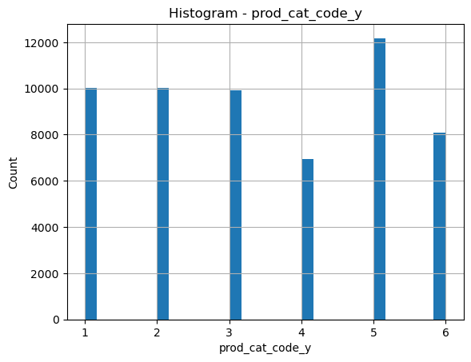 |
|  | 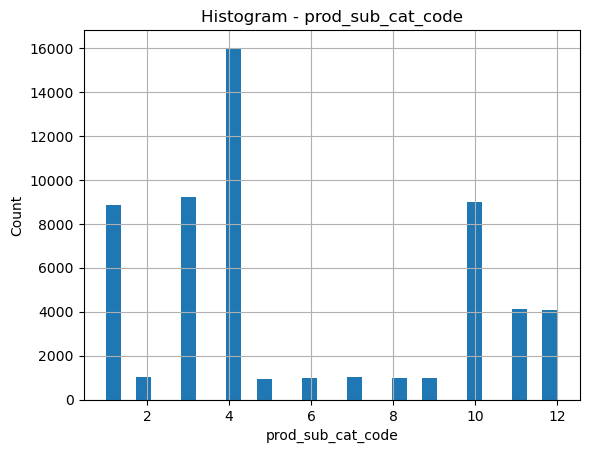 |

### Categorical Variable Frequencies (Bar Charts)

| | |
|---|---|
| 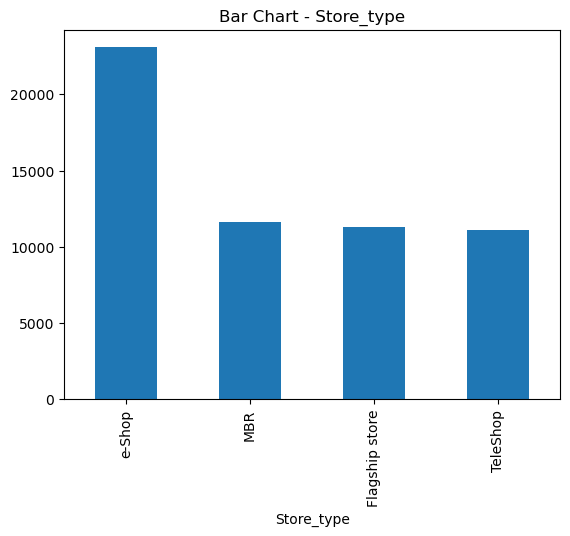 | 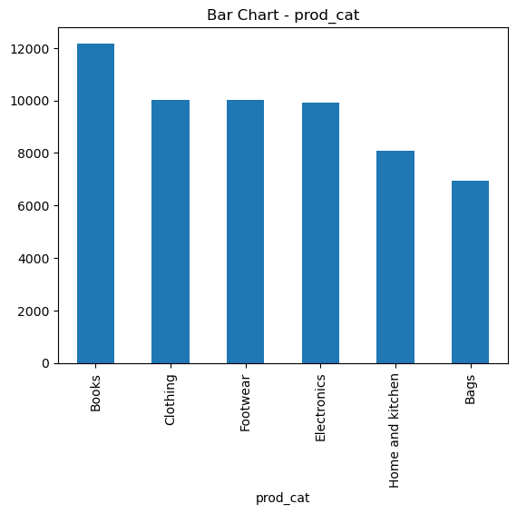 |
| 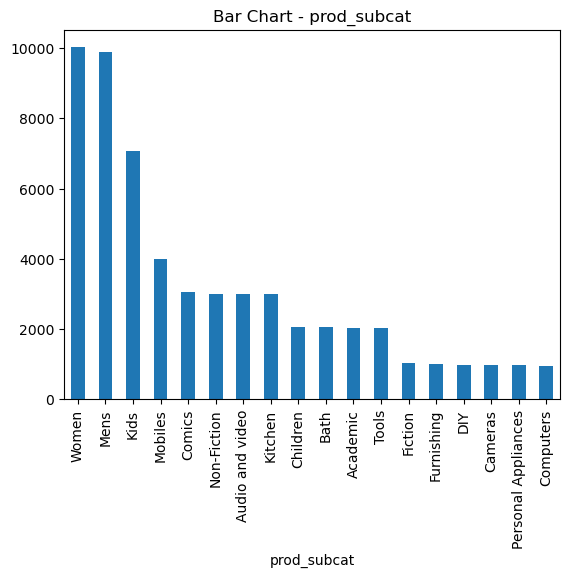 | 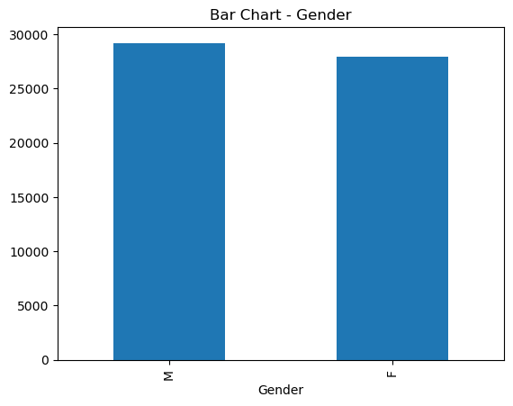 |
| 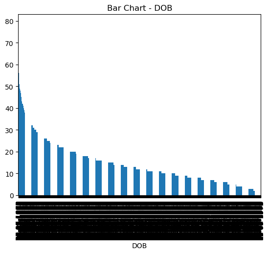 | 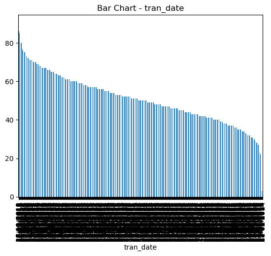 |

---

## 📈 Key Insights
- Certain product categories dominate customer purchases
- Store type significantly impacts total revenue and quantity sold
- Demographic factors such as age and gender influence spending patterns
- A small group of customers contributes to a large number of transactions
- Seasonal trends are visible in transaction data

---

## 👤 Author
**Shubham Vishwakarma**
Aspiring Data Analyst | Machine Learning Enthusiast
